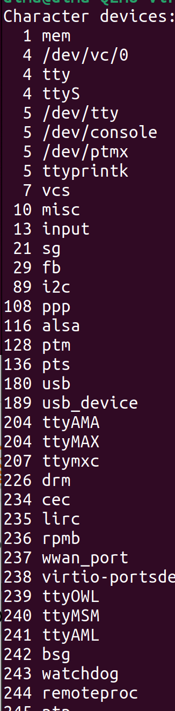
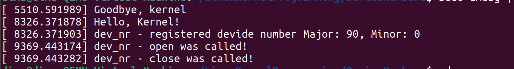

## Connecting a device file with device number

### 1. Check for available device numbers
`cat /proc/devices`

### 2. Load module
`sudo insmod name_of_module.ko`

### 3. Check for changes
`cat /proc/devices | grep my_dev_nr`

### 4. Create device file
`sudo mknod /dev/mydevice c 90 0` (replace 90 with your device number)

### 5. Check
`ls /dev/mydevice -al`

### 6. Checking logs
`sudo dmesg | tail -n 2`

### 7. Create test program to open file( then compile and run)
`vim test.c` (check test.c for code)
`gcc test.c -o test`
`sudo chmod 666 /dev/mydevice`
`./test`

### 8. Check logs for all changes in this module
`sudo dmesg | tail -n 5`

